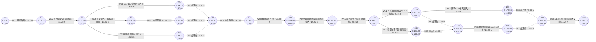

# AOA 主網路（彙總工作包）

圓圈是事件；活動與期望工時標在箭線。虛線是 0 h 虛活動。單位是有效工作小時，箭長不代表時間。

```mermaid
flowchart LR
    E0(("0<br/>E 0.00<br/>L 0.00"))
    E10(("10<br/>E 14.25<br/>L 14.25"))
    E20(("20<br/>E 25.50<br/>L 25.50"))
    E30(("30<br/>E 39.75<br/>L 62.00"))
    E40(("40<br/>E 43.75<br/>L 43.75"))
    E50(("50<br/>E 62.00<br/>L 62.00"))
    E60(("60<br/>E 43.75<br/>L 62.00"))
    E70(("70<br/>E 62.00<br/>L 62.00"))
    E80(("80<br/>E 76.25<br/>L 76.25"))
    E90(("90<br/>E 104.50<br/>L 104.50"))
    E100(("100<br/>E 118.75<br/>L 118.75"))
    E110(("110<br/>E 142.00<br/>L 142.00"))
    E120(("120<br/>E 163.25<br/>L 168.25"))
    E130(("130<br/>E 168.25<br/>L 168.25"))
    E135(("135<br/>E 179.50<br/>L 188.50"))
    E140(("140<br/>E 168.25<br/>L 168.25"))
    E150(("150<br/>E 188.50<br/>L 188.50"))
    E160(("160<br/>E 188.50<br/>L 188.50"))
    E170(("170<br/>E 203.75<br/>L 203.75"))
    E0 -->|"W01 通道品質 / 14.25 h"| E10
    E10 -->|"W02 共用設定與資料契約 / 11.25 h"| E20
    E20 -->|"W03 UE／DU資源時間表 / 14.25 h"| E30
    E20 -->|"W04 固定接入、TBS與PHY / 18.25 h"| E40
    E40 -->|"W05 Tag能量帳本 / 18.25 h"| E50
    E20 -->|"W06 服務與資料認列 / 18.25 h"| E60
    E70 -->|"W07 動作驗證 / 14.25 h"| E80
    E80 -->|"W08 離散事件引擎 / 28.25 h"| E90
    E90 -->|"W09 Node觀測與最小測試策略 / 14.25 h"| E100
    E100 -->|"W10 端到端整合與首版操作 / 23.25 h"| E110
    E110 -->|"W11 正式Baseline與公平性指標 / 21.25 h"| E120
    E110 -->|"W12 模型校準與研究情境 / 26.25 h"| E130
    E140 -->|"W13 實驗框架與Baseline試跑 / 20.25 h"| E150
    E120 -->|"W14 既有CLM策略接入 / 16.25 h"| E135
    E160 -->|"W15 CLM對照實驗與最終交付 / 15.25 h"| E170
    E30 -. "D01 虛活動 / 0.00 h" .-> E70
    E50 -. "D02 虛活動 / 0.00 h" .-> E70
    E60 -. "D03 虛活動 / 0.00 h" .-> E70
    E120 -. "D04 虛活動 / 0.00 h" .-> E140
    E130 -. "D05 虛活動 / 0.00 h" .-> E140
    E135 -. "D06 虛活動 / 0.00 h" .-> E160
    E150 -. "D07 虛活動 / 0.00 h" .-> E160
```

詳細數值見 [CPM表](cpm.csv)；實際單一change排程見 [資源排程](resource-schedule.csv)。
